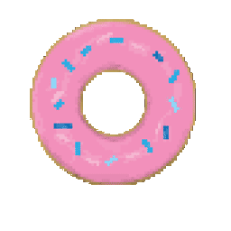

  

  

  
  
  

---

## 👨‍💻 About Me

I like snacks ;) 🍩

  

---

## 🛠️ Tech Stack

  

---

## 📈 GitHub Stats

  
  

  

---

## 🙂 A Bit About Me

I like building useful tools, learning new technologies, and working on projects that combine software, data, and real-world impact.

Outside of coding, I enjoy gaming, exploring new ideas, and building things I find interesting.

---

## 📫 Contact

  
  

  

